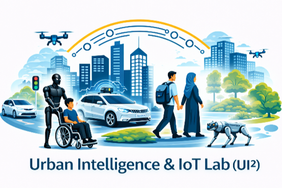
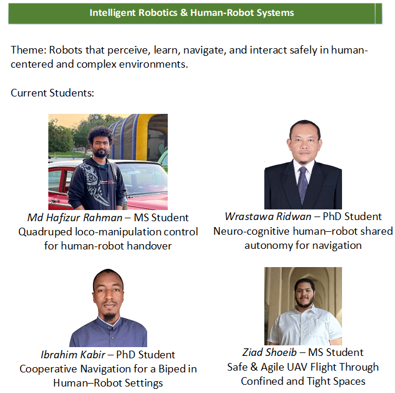
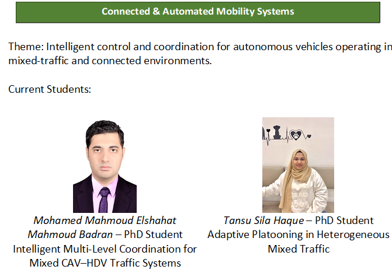
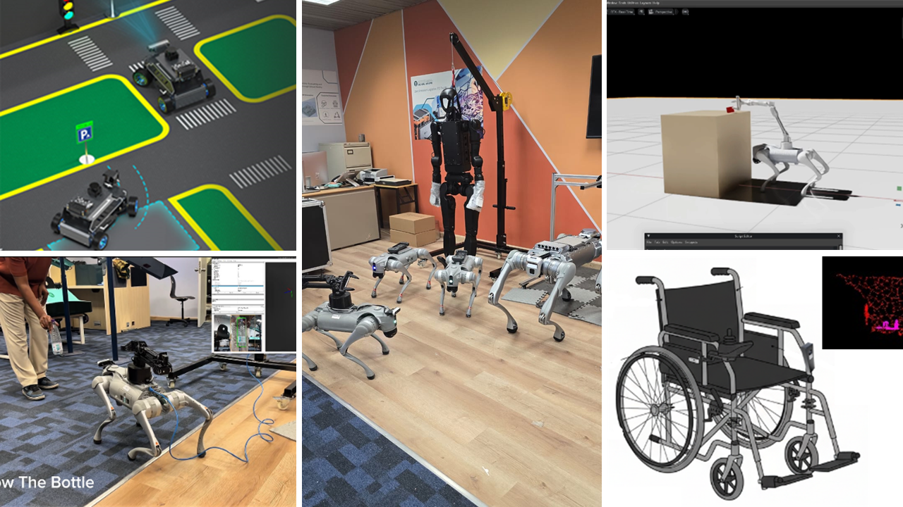
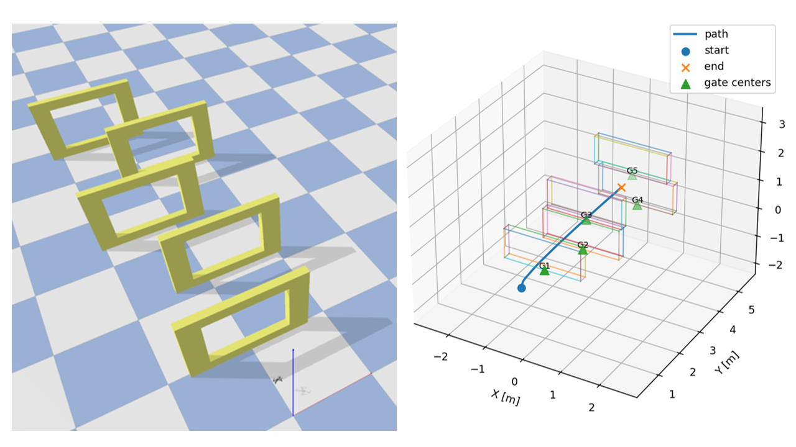

# Urban Intelligence & IoT Lab (UI²)

  

The Urban Intelligence & IoT Lab (UI²) operates under the Interdisciplinary Research Center for Smart Mobility and Logistics (IRC-SML) at King Fahd University of Petroleum & Minerals (KFUPM), Saudi Arabia.
UI² investigates how autonomous agents such as vehicles, robots, and UAVs, together with distributed sensing and IoT data, can be integrated with learning, coordination and control methods, and digital twins to estimate state, predict outcomes, and enable safe real-time decision-making and action in human-centered urban environments. Through this focus, the lab advances intelligent, connected, and human-centered urban systems for autonomous mobility, robotics, and urban infrastructure, contributing to national priorities in smart cities, cognitive mobility, logistics automation, and resilient infrastructure aligned with Saudi Vision 2030. 
Across these domains, UI² emphasizes closed-loop perception, decision-making, and control for autonomous agents operating in shared urban environments.

## Major Focus Areas
1)	Urban autonomy and cooperative mobility, including mixed-traffic decision-making and coordinated maneuvers such as lane changing, merging, platooning, and intersection negotiation.
2)	Learning-enabled control and coordination, combining data-driven methods with robust, explainable, and safety-aware control under communication and operational constraints.
3)	Human-centered robotics and shared autonomy, enabling safe navigation and interaction for wheeled, legged, and aerial robots in human-populated environments.
4)	Distributed sensing and infrastructure intelligence, including IoT-enabled monitoring, event-driven sensing, and prediction for urban utilities such as pipeline networks.
5)	Digital twins for validation and risk-aware deployment, integrating simulation with real sensor data for scenario-based testing, benchmarking, and performance assessment.

## Expected Outcomes
1)	Transferable algorithms and system-level frameworks for human-aware autonomy, coordination, and IoT-driven prediction in smart mobility and infrastructure.
2)	Integrated simulation and digital twin platforms supporting rapid prototyping, human–robot interaction evaluation, and consistent benchmarking using standardized test cases.
3)	National and industry impact through deployable technologies and collaborations with mobility and infrastructure stakeholders.
4)	Human capital development by training students in autonomous systems, control, robotics, and IoT-enabled urban intelligence.

## Current Platforms and Tools
- Unitree quadruped robots (Go2 and B2) for locomotion, navigation, and human–robot interaction research.
- Unitree biped robot (H1-2) for cooperative and socially aware navigation in human-centered environments.
- Robotic wheelchair platform under development for shared autonomy and safe human-centered navigation.
- RoboMaster A1 autonomous cars with driving tracks for coordinated maneuvers, lane-changing, and platooning studies.
- ROS2-based development stack for multi-robot integration and experimentation.
- Gazebo for simulation, prototyping, and validation of robotic and mobility scenarios.
- NVIDIA Isaac Sim for high-fidelity simulation and digital twin development.
- GPU-enabled workstations for learning, optimization, simulation, and digital-twin execution.

## Research Groups

  

  

---
## Ongoing Projects & Open-Source Development
The UI² Lab maintains open-source repositories supporting ongoing research, prototyping, and student-led experimentation in autonomous mobility, robotics, and IoT-enabled urban systems. These repositories reflect active development and may evolve as research progresses.

  

### Quadruped Loco-Manipulation with Human-Robot Handover
[Github Link](https://github.com/nayon007 )

### Safe and Agile UAV Navigation in Confined and Tight Spaces via DRL
This project develops a safety-aware, model-free reinforcement learning framework for agile quadrotor navigation inside tunnels and pipes and general tight and confined spaces, where corridors are narrow, curved, and strongly affected by near-wall aerodynamic disturbances and strict clearance/attitude/speed/actuator constraints. Using Proximal Policy Optimization (PPO) , the policy is trained in a custom environment based on gym-pybullet-drones and simulated with the PyBullet/Bullet physics stack ; the design injects geometry-aware disturbance cues into observations/rewards and adds barrier-inspired safety features to encode wall-clearance and motion limits, with experiments run using standard RL tooling such as Stable-Baselines3. [Project Repository](https://github.com/Ziad-Shoeib/gym-pybullet-drones)

  

